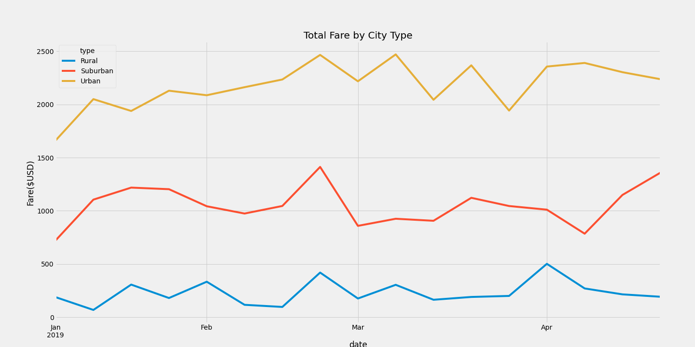

# PyBer Analysis

## Overview of Project

My objective was to create a line graph comparing weekly fare rates per city type, to compare trends across markets.

 
## Results
   
    
    

   Suburban fares started ~1,000, and never passed $1,500, with fares dropping in March and in mid-April.
   Rural fares started at ~$200, and fares rise and fall consistently throughout the months, though profit is never over $500.
   Urban fares start with an average of ~$1,800, which increases up to ~$2,300. This is the only market with consistent profits >$1,500
       
3. **Summary** 

     One way that PyBer could increase revenue in rural and suburban cities is to recruit and hire more drivers. This could make bring the cost of the service down, therefore offering the promise of PyBer's urban convenience is fulfilled. 
     
     PyBer could see expansion in rural cities if their fares were priced more competitively. As with the suggestion to recruit, bringing the price down could see an increase in overall revenue.
     
     Additionally, Urban cities' best bet for growth would be to create opportunities for more rides, or even a slight increase in prices. Overall, though, the focus should be on driving the smaller markets.
